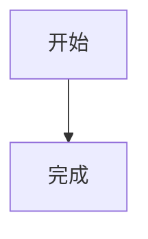

# 编写文档

DocsKit 文档使用 `.md` 或 `.markdown` 文件编写。每篇文档建议保留一个一级标题，用二级标题划分主要章节，用三级标题组织步骤或细节。页面右侧目录展示二至四级标题。

## 文件和标题

文档文件放在配置的文档目录或其子目录中。目录会成为侧边栏分组，文件会成为导航项。文件标题按以下顺序确定：front matter 的 `title`、正文中的第一个标题、文件名推导出的标题。

文件名建议使用小写字母、数字和连字符，例如 `guides/writing-docs.md`。`README.md` 和 `index.md` 在子目录中会使用父目录名称作为默认标题。

## 使用 front matter

front matter 必须从文件第一行开始，用两行单独的 `---` 包围。它只支持以下五个字段：

| 字段 | 类型 | 用途 |
| --- | --- | --- |
| `title` | 字符串 | 覆盖文档标题 |
| `description` | 字符串 | 设置摘要 |
| `order` | 数字 | 设置同级导航顺序 |
| `icon` | 字符串 | 设置文档图标 |
| `hidden` | 布尔值 | 使用 `true` 隐藏文档 |

```md
---
title: 组件规范
description: 组件的使用方式与设计约束
order: 2
icon: blocks
hidden: false
---

# 组件规范
```

配置文件中的路径图标和类型默认图标优先于 front matter 的 `icon`。`hidden: true` 的文档不会出现在导航和站内搜索中。

## 使用 Markdown 语法

DocsKit 支持标题、段落、嵌套列表、任务列表、代码块、表格、引用、提示框、脚注、粗体、斜体、粗斜体、删除线、行内代码、自动链接、引用链接、图片、视频、音频和附件下载。代码块使用三个或更多反引号或波浪号包围，并可写语言名称；常见语言会在服务端安全高亮，默认显示行号和复制按钮，未知语言按纯文本显示。行号、高亮、复制按钮和长行换行可以通过 `markdown.code` 配置控制，详见[配置文件](../api/configuration.md)。

原生 HTML 会按文本转义，以避免文档内容注入页面结构。数学公式支持 `$...$`、`\(...\)`、`$$...$$` 和 `math`/`latex` 代码块；Mermaid 使用 `mermaid` 代码块并在页面加载后安全渲染，脚本或语法失败时保留代码回退。文档中的脚本和任意 HTML 不会执行。

~~~markdown
行内公式 $E=mc^2$

$$
\sum_{i=1}^{n} i = \frac{n(n+1)}{2}
$$


~~~

## 在正文展示图标

可以使用 `:icon[图标名称]` 在普通 Markdown 文本中展示内置图标，例如：:icon[rocket]。图标名称必须来自[配置文件](../api/configuration.md)中的内置图标清单；写在代码块或行内代码中的标记会保持原样。

```markdown
安装命令 :icon[download]
```

## 使用链接

站内文档使用相对路径，并保留 `.md` 或 `.markdown` 扩展名：

```markdown
[安装与启动](../getting-started/installation.md)
[全文搜索](../api/search.md)
```

标题锚点使用 `#` 加标题生成的 id。外部链接必须使用真实地址，例如[智能体](https://chat.mymyjd.com)、[免费 AI](https://aiapi.mymyjd.cn)和[免费代理](https://proxy.mymyjd.com)。不要保留 `example.com`、空的 `href` 或不存在的相对路径。

## 播放媒体和下载文件

图片语法也支持本地或远程音视频资源。视频和音频会使用浏览器原生控件，视频资源支持进度拖动和 Range 分片请求：

下面是本项目官方文档中的真实媒体演示，资源位于 `docs/` 目录，打开页面即可直接查看、播放：


```markdown


```

支持的视频扩展名包括 `.mp4`、`.webm`、`.ogv`、`.mov`、`.m4v` 和 `.avi`；支持的音频扩展名包括 `.mp3`、`.wav`、`.ogg`、`.oga`、`.m4a`、`.aac`、`.flac` 和 `.weba`。

常见附件使用普通链接即可触发下载，服务端会返回 `Content-Disposition: attachment`，并保留 UTF-8 文件名：

```markdown
[下载产品手册](assets/manual.pdf)
[下载源代码](assets/source.zip)
```

支持 PDF、Office 文档、压缩包、CSV、TXT、JSON、XML 等公开附件。Markdown 原文、隐藏文件、配置文件、符号链接和越界路径不会被下载接口暴露。

## 配置站点

需要调整全局品牌、SEO、页脚、顶部导航、排序、图标或展开方式时，编辑文档目录下的 `docs.config.json`，不要把这些字段写进单篇文档的 front matter。完整字段见[配置文件](../api/configuration.md)。

## 交付前检查

- [ ] 文件扩展名为 `.md` 或 `.markdown`。
- [ ] front matter 位于第一行，只使用受支持字段。
- [ ] 每篇文档有清晰的标题和摘要。
- [ ] 相对链接都指向实际存在的文档。
- [ ] 外部链接使用真实的 `https://` 地址。
- [ ] 代码围栏闭合，表格分隔线和列数正确。
